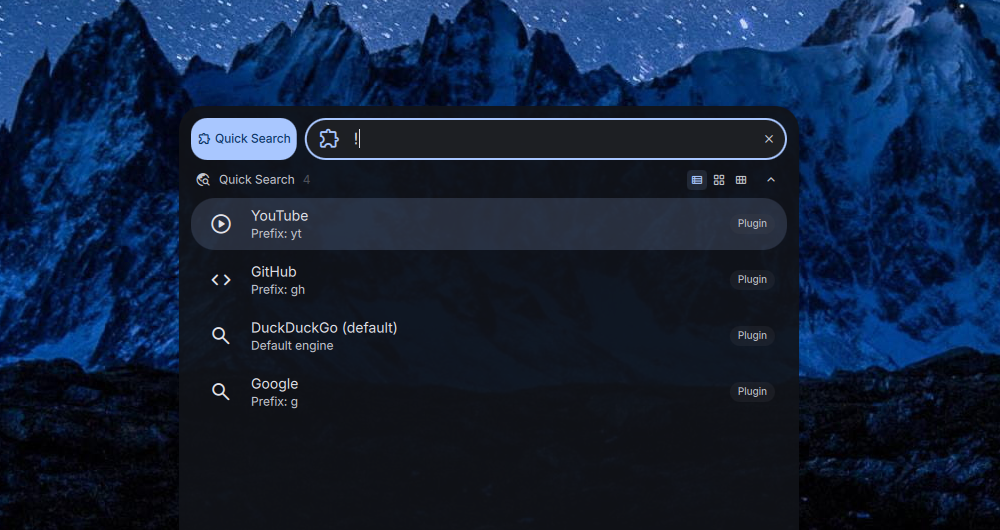

# DankQuickSearch

A minimal launcher plugin for [DankMaterialShell](https://github.com/AvengeMedia/DankMaterialShell) that adds quick web search with engine prefixes.

## This is a fork

This is a fork that has customized the default search engine to use a self-hosted searXNG instance.

You can find the original work by alcxyz [here](https://github.com/alcxyz/DankQuickSearch).

## Features

- Search searXNG (self-hosted), Google, ArchWiki, and YouTube from the launcher
- Engine prefixes for quick switching (`g`, `aw`, `yt`)
- Direct URL detection — type a URL to open it
- Configurable default search engine

## Installation

Copy the plugin directory to `~/.config/DankMaterialShell/plugins/DankQuickSearch/`.

## Usage

Activate with `!` (default trigger) in the DMS launcher, then:

- `!hello world` — search default search engine for "hello world"
- `!g hello world` — search Google
- `!aw nix flake` — search ArchWiki
- `!yt music video` — search YouTube
- `!github.com` — open URL directly

## Requirements

- `xdg-open` (for opening URLs in the default browser)

## License

MIT
